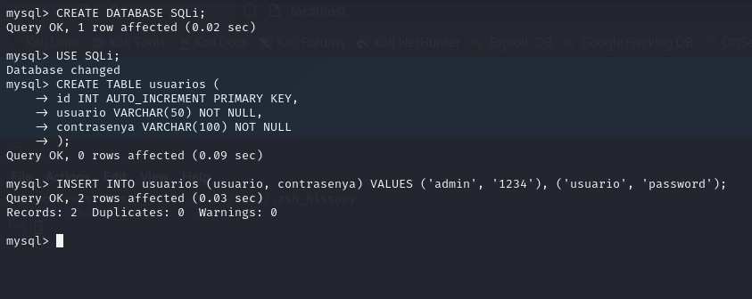
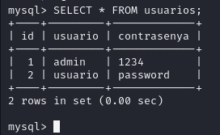
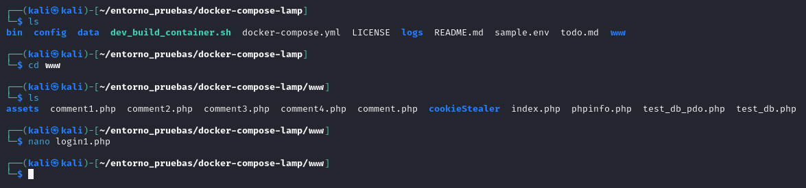
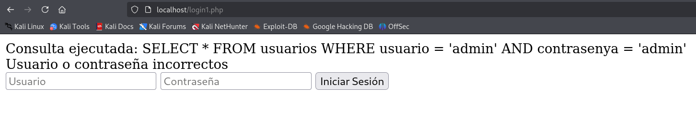
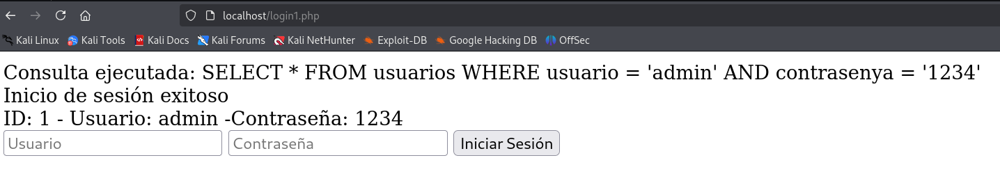
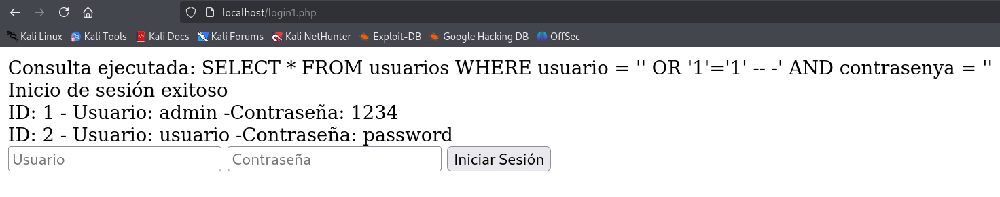
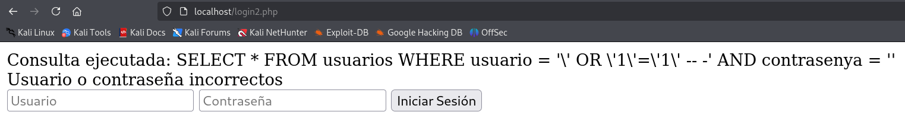
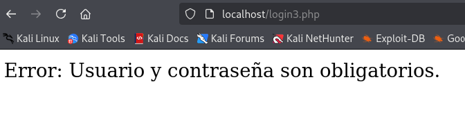

# PPS-Unidad3Actividad4-Cristian

## Índice

- [PPS-Unidad3Actividad4-Cristian](#pps-unidad3actividad4-cristian)
  - [Índice](#índice)
  - [🔍 Descripción](#-descripción)
  - [🎯 Objetivos](#-objetivos)
  - [🧠 ¿Qué es SQL Injection?](#-qué-es-sql-injection)
    - [Tipos de XSS](#tipos-de-xss)
  - [✍🏻 Actividades a realizar](#-actividades-a-realizar)
    - [Creación de la BBDD](#creación-de-la-bbdd)
    - [Crear página web en Apache](#crear-página-web-en-apache)
    - [❗Explotación de inyección SLQi](#explotación-de-inyección-slqi)
    - [Mitigación](#mitigación)
      - [Mitigación 1 - Escapar los caracteres especiales](#mitigación-1---escapar-los-caracteres-especiales)
      - [Mitigación 2 - Uso de consultas parametrizadas](#mitigación-2---uso-de-consultas-parametrizadas)

---

## 🔍 Descripción

Esta actividad tiene como objetivo explorar vulnerabilidades de tipo **SQL Injection (SQLi)** y aplicar técnicas de mitigación en una aplicación web vulnerable. A través del análisis del código y pruebas prácticas, se busca comprender cómo se pueden explotar consultas SQL mal construidas y cómo prevenir estos ataques mediante buenas prácticas de desarrollo.

---

## 🎯 Objetivos

- Identificar y comprender las distintas formas de inyección SQL.
- Explorar cómo se pueden explotar vulnerabilidades SQLi en aplicaciones web.
- Analizar el código fuente de una aplicación vulnerable.
- Aplicar técnicas de mitigación y buenas prácticas para evitar SQLi.


---

## 🧠 ¿Qué es SQL Injection?

**SQL Injection (SQLi)** es una vulnerabilidad de seguridad que permite a un atacante interferir con las consultas que una aplicación realiza a su base de datos. Al manipular entradas del usuario no correctamente validadas, un atacante puede ejecutar comandos SQL arbitrarios, lo que puede llevar al acceso no autorizado, modificación o eliminación de datos.

### Tipos de XSS

1. **Inyección clásica (o directa)**: El atacante inserta directamente comandos SQL en campos de entrada, como formularios de login o búsqueda.
2. **Inyección basada en errores**: Se utilizan mensajes de error devueltos por la base de datos para obtener información del sistema.
3. **Inyección ciega (Blind SQLi)**: No se muestran errores directamente, pero el atacante deduce información mediante respuestas condicionales.
4. **Inyección basada en tiempo**: El atacante infiere datos al provocar retardos en la respuesta del servidor mediante funciones de espera (por ejemplo, ``SLEEP()``).

---

## ✍🏻 Actividades a realizar

Para comenzar vamos a utilizar el entorno de pruebas de la actividad [Actividad 1 - Unidad 3](https://github.com/Clealg01/PPS-Unidad3Actividad1-Cristian). En esta actividad nos clonamos un entorno de pruebas lamp, el cual utilizaremos para las actividades.

### Creación de la BBDD
Para poder crear una base de datos de prueba tenemos varias opciones:

- **Introducirnos en el contenedor** que contiene la base de datos.
- Realizarlo desde el **panel de administración**.
  - Introduciendo las consultas desde el IDE de la plataforma
  - De forma gráfica, también desde la interfaz gráfica del administrador.

En este caso usaremos la primera opción. Ejecutaremos los siguientes comandos:

```bash
docker exec -it  lamp-mysql8  /bin/bash
mysql -u root -p
```

Una vez dentro de la base de datos, ejecutaremos las siguientes sentencias:

```sql
CREATE DATABASE SQLi;
USE SQLi;
CREATE TABLE usuarios (
	id INT AUTO_INCREMENT PRIMARY KEY,
	usuario VARCHAR(50) NOT NULL,
	contrasenya VARCHAR(100) NOT NULL
);
INSERT INTO usuarios (usuario, contrasenya) VALUES ('admin', '1234'), ('usuario', 'password');
```

<p align="center">
  
</p>
<p align="center"><em>Creación de la base de datos con datos de ejemplo</em></p>

<p align="center">
  
</p>
<p align="center"><em>Comprobación de los datos de la BBDD</em></p>


### Crear página web en Apache

Para tener un archivo de pruebas con el que realizar las inyecciones sql, crearemos primero en la montura de nuestras carpetas un archivo mal securizado:

<p align="center">
  
</p>
<p align="center"><em>Creación del archivo de pruebas</em></p>

El código de este archivo será:

```php
<?php
$conn = new mysqli("database", "root", "tiger", "SQLi");
        if ($_SERVER["REQUEST_METHOD"] == "POST") {
                $username = $_POST["username"];
                $password = $_POST["password"];
                $query = "SELECT * FROM usuarios WHERE usuario = '$username' AND contrasenya = '$password'";
                echo "Consulta ejecutada: " . $query . "<br>";
                $result = $conn->query($query);
                if ($result) {
                        if ($result->num_rows > 0) {
                                echo "Inicio de sesión exitoso<br>";
                                // Modificación: Mostrar datos extraídos de la consulta
                                while ($row = $result->fetch_assoc()) {
                                        echo "ID: " . $row['id'] . " - Usuario: " . $row['usuario'] . " -Contraseña: " . $row['contrasenya'] . "<br>";
                                }
                } else {
                        echo "Usuario o contraseña incorrectos";
                }
        } else {
                echo "Error en la consulta: " . $conn->error;
        }
} 
?>
<form method="post">
        <input type="text" name="username" placeholder="Usuario">
        <input type="password" name="password" placeholder="Contraseña">
        <button type="submit">Iniciar Sesión</button>
</form>
<?
```

Ahora probamos a ver como funciona el código:

<p align="center">
  
</p>
<p align="center"><em>Prueba del funcionamiento del código con usuario y contraseña incorrectos</em></p>

<p align="center">
  
</p>
<p align="center"><em>Prueba del funcionamiento del código con usuario y contraseña correctos</em></p>


### ❗Explotación de inyección SLQi

Vamos a realizar una inyección básica para observar cómo se comporta la aplicación ante entradas maliciosas. En este caso, utilizamos la siguiente cadena en el campo de nombre de usuario:

```sql
' OR '1'='1' -- -
```

Como ``'1'='1'`` es una condición que siempre es **verdadera**, la cláusula ``WHERE`` permite que la consulta devuelva todos los registros de la tabla en uso de este código. 

<p align="center">
  
</p>
<p align="center"><em>Explotación de inyección SQLi</em></p>

Es por eso que el lenguaje estará comprobando el usuario y en vez de encontrarse con un posible usuario de la base de datos, se está encontrando una condición verdadera y la sentencia resultante será totalmente distinta a la que se había diseñado.

### Mitigación

Como ya hemos visto, permitir que nuestra página tenga fallos de seguridad como estos es muy peligroso. Es por ello que ahora vamos a revisar varias técnicas para mitigar estos fallos:

#### Mitigación 1 - Escapar los caracteres especiales

La primera aproximación para mitigar ataques de inyección SQL consiste en escapar los caracteres especiales que podrían alterar la lógica de las consultas. Caracteres como comillas simples (`'`), comillas dobles (`"`), barras invertidas (`\`) o valores nulos pueden ser utilizados por un atacante para manipular consultas SQL si no se gestionan correctamente. Para evitar esto, se puede utilizar la función ``addslashes()``, que añade automáticamente una barra invertida delante de estos caracteres en las entradas del usuario.

Esta solución, aunque algo rudimentaria, puede ser útil para evitar inyecciones básicas al asegurar que los valores proporcionados se traten literalmente dentro de la consulta SQL. Sin embargo, no es una protección definitiva, ya que sigue dejando expuesta la aplicación a otros riesgos si no se implementan controles adicionales, como el uso de **consultas preparadas**, almacenamiento seguro de contraseñas y manejo adecuado de sesiones.

```php
<?php
$conn = new mysqli("database", "root", "tiger", "SQLi");
        if ($_SERVER["REQUEST_METHOD"] == "POST") {
                $username = $_POST["username"];
                $password = $_POST["password"];
                $username = addslashes($username);
                $password = addslashes($password);
                $query= "SELECT * FROM usuarios WHERE usuario = '$username' AND contrasenya = '$password'";
                echo "Consulta ejecutada: " . $query . "<br>";
                $result = $conn->query($query);
                if ($result) {
                        if ($result->num_rows > 0) {
                                echo "Inicio de sesión exitoso<br>";
                                // Modificación: Mostrar datos extraídos de la consulta
                                while ($row = $result->fetch_assoc()) {
                                        echo "ID: " . $row['id'] . " - Usuario: " . $row['usuario'] . " -Contraseña: " . $row['contrasenya'] . "<br>";
                                }
                } else {
                        echo "Usuario o contraseña incorrectos";
                }
        } else { 
                echo "Error en la consulta: " . $conn->error;
        }
}
?>
<form method="post">
        <input type="text" name="username" placeholder="Usuario">
        <input type="password" name="password" placeholder="Contraseña">
        <button type="submit">Iniciar Sesión</button>
</form>
<?
```

<p align="center">
  
</p>
<p align="center"><em>Comprobación con el código con la mitigación 1</em></p>


#### Mitigación 2 - Uso de consultas parametrizadas

En esta versión mejorada del código, se aplican prácticas modernas y seguras para evitar ataques de inyección SQL y proteger la información sensible de los usuarios. Se hace uso de consultas preparadas con ``prepare()`` y ``bind_param()``, lo cual garantiza que las entradas del usuario sean tratadas como datos, no como parte del código SQL, eliminando así la necesidad de funciones como ``addslashes()``.

Además, se ha implementado la verificación de contraseñas hasheadas mediante ``password_hash()`` y ``password_verify()``, lo que protege las credenciales en caso de que la base de datos sea comprometida. También se incluye el uso de ``htmlspecialchars()`` al mostrar los datos, mitigando así posibles ataques XSS. Esta combinación de prácticas proporciona una base sólida para desarrollar aplicaciones web seguras y resistentes a ataques comunes.

```php
<?php
$conn = new mysqli("database", "root", "tiger", "SQLi");

// Verificar conexión
if ($conn->connect_error) {
    die("Error de conexión: " . $conn->connect_error);
}

if ($_SERVER["REQUEST_METHOD"] == "POST") {
    $username = $_POST["username"] ?? '';
    $password = $_POST["password"] ?? '';

    // Verificar si los campos están vacíos
    if (empty($username) || empty($password)) {
        die("Error: Usuario y contraseña son obligatorios.");
    }

    // Consulta segura con prepared statements
    $query = "SELECT id, usuario, contrasenya FROM usuarios WHERE usuario = ?";
    $stmt = $conn->prepare($query);
    
    if (!$stmt) {
        die("Error en la preparación de la consulta: " . $conn->error);
    }

    $stmt->bind_param("s", $username);
    $stmt->execute();
    $result = $stmt->get_result();

    if ($result && $result->num_rows > 0) {
        $row = $result->fetch_assoc();
        
        // Verificar contraseña hasheada (suponiendo uso de password_hash())
        if (password_verify($password, $row["contrasenya"])) {
            echo "Inicio de sesión exitoso<br>";
            echo "ID: " . htmlspecialchars($row['id']) . " - Usuario: " . htmlspecialchars($row['usuario']) . "<br>";
        } else {
            echo "Usuario o contraseña incorrectos";
        }
    } else {
        echo "Usuario o contraseña incorrectos";
    }

    $stmt->close();
}

$conn->close();
?>

<form method="post">
    <input type="text" name="username" placeholder="Usuario">
    <input type="password" name="password" placeholder="Contraseña">
    <button type="submit">Iniciar Sesión</button>
</form>
<?
```

<p align="center">
  
</p>
<p align="center"><em>Comprobación con el código con la mitigación 2</em></p>

